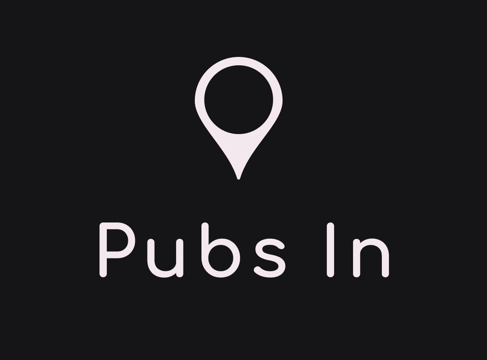

<h1 align="center">
    
</h1>
<h2 align="center">
  ReactJS Application for Pubs In Admin-dashboard
</h2>
<h3 align="center">
    🚧 Work in Progress 🚧
</h3>

<p align="center">
  <a href="#%EF%B8%8F-about-the-project">About the project</a>&nbsp;&nbsp;&nbsp;|&nbsp;&nbsp;&nbsp;
  <a href="#-technologies">Technologies</a>&nbsp;&nbsp;&nbsp;|&nbsp;&nbsp;&nbsp;
  <a href="#-getting-started">Getting started</a>&nbsp;&nbsp;&nbsp;|&nbsp;&nbsp;&nbsp;
  <a href="#-license">License</a>
</p>

## 🎯 About <a name = "about"></a>

As soon as possible I will put informations about the project

## [🌌 See the project prototype made on figma](https://www.figma.com/file/aS7BPFVnaqvqkEo5xZ7ueW/pubsin-dashboard?node-id=0%3A1)

## 🚀 Technologies

Technologies that I used to develop this web client

- [ReactJS](https://reactjs.org/)
- [TypeScript](https://www.typescriptlang.org/)
- [React Router DOM](https://reacttraining.com/react-router/)
- [React Icons](https://react-icons.netlify.com/#/)
- [React Input Mask](https://github.com/sanniassin/react-input-mask)
- [Yup](https://github.com/jquense/yup)
- [Unform](https://unform.dev/)
- [Yup](https://github.com/jquense/yup)
- [Styled Components](https://styled-components.com/)
- [Polished](https://github.com/styled-components/polished)
- [Axios](https://github.com/axios/axios)
- [Eslint](https://eslint.org/)
- [Prettier](https://prettier.io/)
- [EditorConfig](https://editorconfig.org/)


## 💻 Getting Started <a name = "getting_started"></a>

These instructions will get you a copy of the project up and running on your local machine for development and testing purposes.


### Installing

Clone the repository and access the project directory

```bash
git@github.com:Guribeiro/pubsin-dashboard.git && cd pubsin-dashboard
```
Install all dependencies
```bash
yarn
```
Run dev server
```bash
yarn dev
```

The client will be running at **http://localhost:3333**

## 📝 License

This project is licensed under the MIT License - see the [LICENSE](LICENSE) file for details.

---

Made with 💜 &nbsp;by Gustavo Henrique 👋 &nbsp;[See my linkedin](https://www.linkedin.com/in/gustavohribeiro/)

